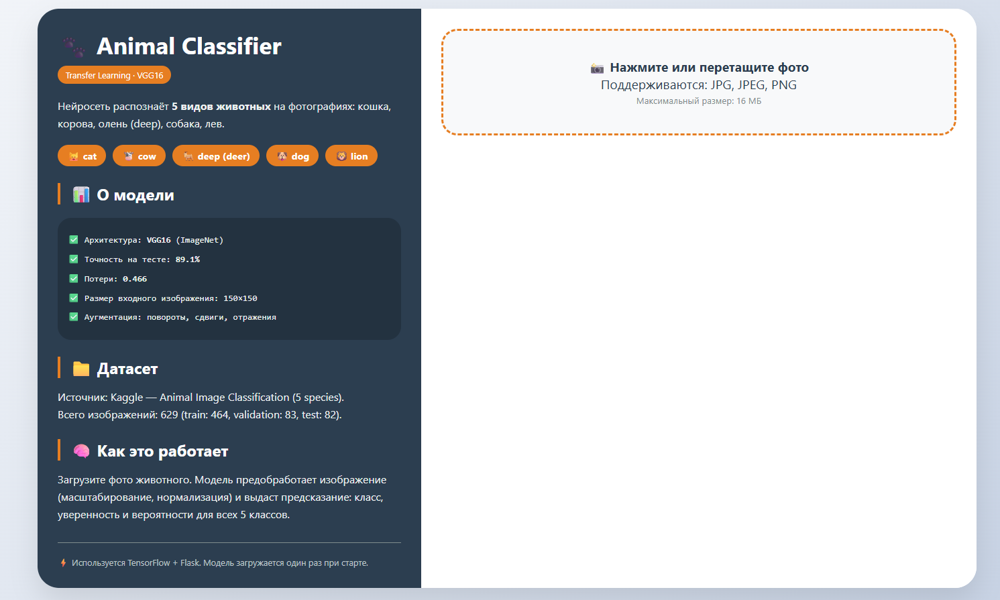

# 🐾 Animal Image Classification (5 species)

**Классификация изображений животных с помощью свёрточных нейросетей**  
Модели: базовая CNN (с нуля) и трансферное обучение (VGG16).  
Реализован веб-интерфейс на Flask для загрузки фото и получения предсказаний.

  

---

## 📋 Содержание

- [О проекте](#о-проекте)
- [Демонстрация](#демонстрация)
- [Структура проекта](#структура-проекта)
- [Установка и запуск](#установка-и-запуск)
- [Использование веб-интерфейса](#использование-веб-интерфейса)
- [Скрипты для обучения и оценки](#скрипты-для-обучения-и-оценки)
- [Результаты](#результаты)
- [Технологии](#технологии)
- [Лицензия](#лицензия)

---

## О проекте

Датасет: **Animal Image Classification (5 species)** с Kaggle.  
Классы: `cat` (кошка), `cow` (корова), `deep` (олень, в датасете назван `deep`), `dog` (собака), `lion` (лев).

**Цели проекта:**
- Реализовать пайплайн предобработки и аугментации изображений.
- Обучить базовую свёрточную сеть с нуля.
- Применить трансферное обучение (VGG16, предобученная на ImageNet).
- Сравнить качество моделей.
- Разработать веб-интерфейс для демонстрации работы лучшей модели.

---

## Демонстрация

Веб-приложение позволяет:
- Загрузить изображение (перетаскиванием или через кнопку).
- Получить предсказанный класс, уверенность и вероятности для всех пяти классов.
- Загрузить другое фото без перезагрузки страницы.

---

## Структура проекта

```
Animal Image Classification/
├── app.py                     # Flask-приложение
├── templates/
│   └── index.html             # веб-интерфейс
├── uploads/                   # временные файлы (игнорируется git)
├── data/
│   ├── train/                 # обучающие изображения по классам
│   ├── validation/            # валидационные изображения
│   └── test/                  # тестовые изображения
├── model/
│   ├── transfer_vgg16_best.keras    # лучшая модель (VGG16)
│   ├── transfer_vgg16_final.keras
│   ├── baseline_cnn_best.keras
│   └── *.png                  # графики и матрица ошибок
├── scr/
│   ├── check.py               # первичный анализ данных
│   ├── train_cnn.py           # обучение базовой CNN
│   ├── transfer_learning.py   # обучение VGG16
│   ├── evaluate.py            # метрики и confusion matrix
│   └── predict.py             # консольное предсказание
├── notebooks/
│   └── 1.ipynb                # Jupyter ноутбук с полным анализом
├── requirements.txt
├── .gitignore
└── README.md
```

---

## Установка и запуск

### 1. Клонировать репозиторий

```bash
git clone https://github.com/kr0tDV/animal-image-classification
cd animal-image-classification
```

### 2. Создать виртуальное окружение (рекомендуется)

```bash
python -m venv venv
source venv/bin/activate   # Linux/Mac
venv\Scripts\activate      # Windows
```

### 3. Установить зависимости

```bash
pip install -r requirements.txt
```

Если возникают проблемы с сетью, используйте зеркало:

```bash
pip install -i https://pypi.tuna.tsinghua.edu.cn/simple -r requirements.txt
```

### 4. Запустить веб-приложение

```bash
python app.py
```

Откройте браузер по адресу: **http://127.0.0.1:5000**

---

## Использование веб-интерфейса

1. **Загрузите фото** – кликните на область или перетащите файл (JPG, PNG).
2. **Нажмите «Распознать»** – модель обработает изображение и покажет результат.
3. **Изучите результат** – название класса, уверенность, вероятности по всем животным.
4. **Загрузите новое фото** – кнопка «Загрузить новое фото» очистит форму.

---

## Скрипты для обучения и оценки

Все скрипты находятся в папке `scr/`. Перед запуском убедитесь, что структура `data/` соответствует ожидаемой (папки `train`, `validation`, `test` с подпапками классов).

| Скрипт | Назначение |
|--------|-------------|
| `check.py` | Проверка данных, визуализация примеров |
| `train_cnn.py` | Обучение базовой CNN (с нуля) |
| `transfer_learning.py` | Обучение VGG16 (трансферное обучение) |
| `evaluate.py` | Оценка лучшей модели: метрики, confusion matrix |
| `predict.py` | Консольное предсказание класса для одного изображения |

Пример:

```bash
python scr/predict.py "data/test/cat/images (1).jpeg"
```

---

## Результаты

| Модель | Точность на тесте | Потери |
|--------|------------------|--------|
| Базовая CNN (с нуля) | ~20.7% | высокие |
| **VGG16 (трансферное обучение)** | **89.1%** | **0.466** |

**Classification report (VGG16):**

| Класс | Precision | Recall | F1-score |
|-------|-----------|--------|----------|
| cat   | 0.92      | 0.85   | 0.88     |
| cow   | 0.95      | 0.91   | 0.93     |
| deep  | 0.94      | 0.89   | 0.91     |
| dog   | 0.80      | 0.86   | 0.83     |
| lion  | 0.91      | 0.95   | 0.93     |

**Confusion matrix** – см. `model/confusion_matrix.png`

**Графики обучения** – см. `model/transfer_vgg16_history.png`

---

## Технологии

- **Python 3.8+**
- **TensorFlow 2.x / Keras** – глубокое обучение
- **Flask** – веб-фреймворк
- **OpenCV, NumPy** – обработка изображений
- **Matplotlib, Seaborn** – визуализация
- **scikit-learn** – метрики

---

## Источники 
  
Датасет: [Kaggle – Animal Image Classification (5 species)](https://www.kaggle.com/datasets/miadul/animal-image-classification-5-species)

---

